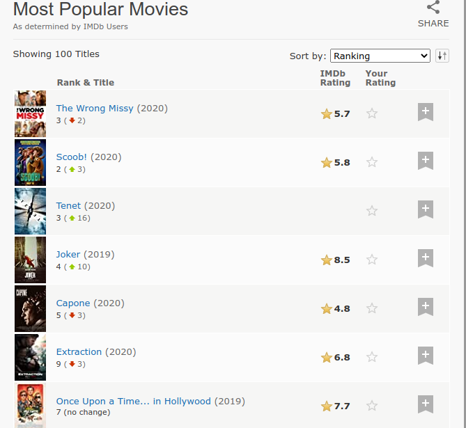
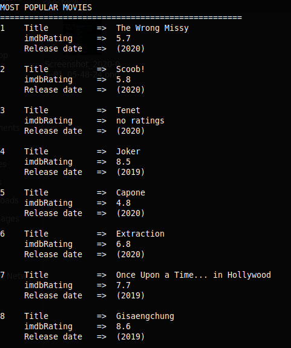
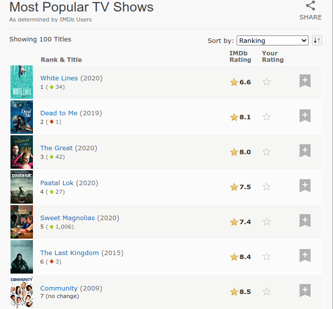
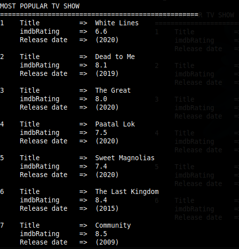

# scraper for IMDB most popular movies & tv

## Built With

- Ruby 2.6

## Live Demo

## Getting Started
Make sure ruby is installed on your machine. Clone the repository and open terminal in that directory.

 `ruby bin/scrap`
